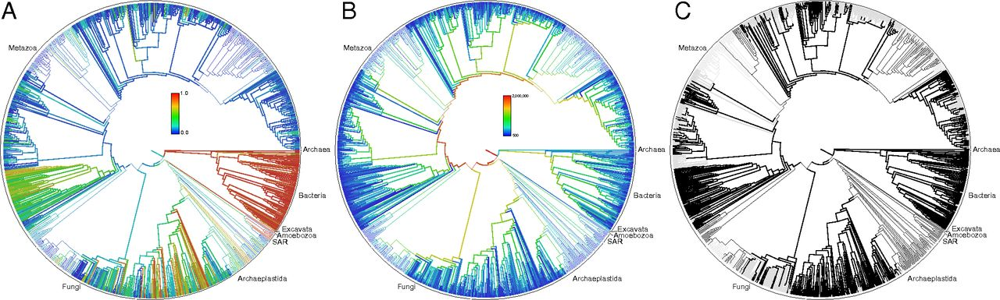
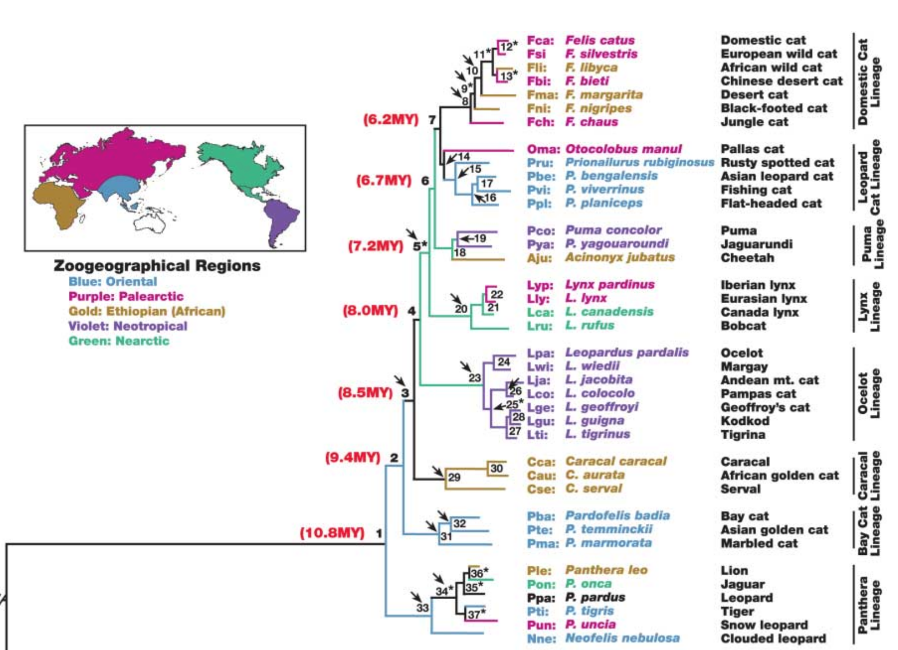

```{r setup, echo=FALSE}
library(ape)
library(dplyr)
```

## Everybody wants trees

* Easier to build accurate trees
* Better methods to use them
* Difficult to get tree for arbitrary species

---

## Open Tree of Life

```{r, echo=FALSE}

```

unified tree with 2.3 million tips

---

## R and its ecosystem

* 30+ packages to work with phylogenies and associated data:

  - https://cran.r-project.org/web/views/Phylogenetics.html

* rOpenSci packages to interact with public data

```{r, echo=FALSE}
knitr::include_graphics("ropensci.svg")
```

---

## Where to get the package?

```{r install, echo=TRUE, eval=FALSE}
## Release version
install.pacakges("rotl")
## Development version
source("https://install-github.me/ropensci/rotl")
```

Load the package

```{r load, echo=TRUE}
library(rotl)
```

---

## How to get a tree from a list of species?

### Step 1: match the names to the OTT ids

```{r, echo=TRUE, cache=TRUE}
taxa <- tnrs_match_names(names =
            c("Chlamydomonas reinhardtii",
              "Drosophila melanogaster", "Arabidopsis thaliana",
               "Rattus norvegicus", "Mus musculus",
               "Cavia porcellus", "Xenopus laevis",
               "Saccharomyces cervisae", "Danio rerio"))
head(taxa, 2)
```

---

## How to get a tree from a list of species?

### Step 2: plot the tree


```{r, fig.height=6}
tr <- tol_induced_subtree(ott_id(taxa))
plot(tr)
```

---

## How to get taxonomic information?

```{r mono, cache=TRUE, warning=FALSE}
mono <- tnrs_match_names("monotremata")
mono_tr <- taxonomy_subtree(ott_id(mono), output_format = "phylo")
plot(mono_tr)
```

---

## How to get taxonomic information?

```{r mono-lineage, cache=TRUE, warning=FALSE}
mono %>%
    ott_id() %>%
    tol_node_info(include_lineage = TRUE) %>%
    tax_lineage() %>%
    filter(rank != "no rank") %>%
    select(- unique_name)
```

---

## How to get trees from published studies?

```{r, cache=TRUE}
cat_studies <- studies_find_studies(
    property = "ot:focalCladeOTTTaxonName",
    value = "Felidae", exact = TRUE)
cat_studies
cat_tree <- get_study_tree("pg_1981", tree_id = "tree4052")
```

---

## The tree

.pull-left[
```{r, fig.height=8.5}
plot(cat_tree, cex = .8, no.margin = TRUE)
```
]

.pull-right[
```{r, echo=FALSE}

```
Figure from the original paper (Johnson et 2006)
]
---

## Link to other data sources

```{r lynx-data, echo=FALSE, cache=TRUE}
## load required packages. Versions used for the manuscript listed below.
library(rotl)
library(rgbif)
library(ggplot2)
library(maps)

## Import the felid tree using study and tree IDs discovered with
## studies_find_studies() in the manuscript
cat_tree <- get_study_tree(study_id ="pg_1981",
                           tree_id = "tree4052")

## Find the species of Lynx in the phylogeny
cat_species <- cat_tree$tip.label
lynx_species <- grep("^Lynx", cat_tree$tip.label, value = TRUE)

## Match the Lynx species to the GBIF identifiers
gbif_keys <- sapply(lynx_species,
                    function(x) name_backbone(name = x)$speciesKey,
                    USE.NAMES = FALSE)

## Search for the GBIF records for these species
lynx_loc <- occ_search(taxonKey = gbif_keys, limit = 500,
                       return = "data", fields = "minimal",
                       hasCoordinate = TRUE)

## Make a data frame of the results
lynx_loc <- do.call("rbind", lynx_loc)
names(lynx_loc)[1] <- "Species"

## Clean up the data with missing locality data
lynx_loc[["decimalLatitude"]] <- as.numeric(lynx_loc[["decimalLatitude"]])
lynx_loc[["decimalLongitude"]] <- as.numeric(lynx_loc[["decimalLongitude"]])
lynx_loc[lynx_loc[["decimalLatitude"]] == 0 &
         lynx_loc[["decimalLongitude"]] == 0,
         c("decimalLatitude","decimalLongitude")] <- c(NA, NA)
lynx_loc <- lynx_loc[complete.cases(lynx_loc), ]
```

.pull-left[
```{r, echo=FALSE, cache=TRUE, dependson='lynxdata'}
## Draw the map
world <- map_data("world")

ggplot(lynx_loc) +
    annotation_map(world, fill="gray40") +
    geom_point(aes(y = decimalLatitude, x = decimalLongitude, color = Species),
               size = 1) +
    coord_map(projection = "mercator", orientation = c(90, 0, 0)) +
    xlab("Longitude") + ylab("Latitude") +
    theme(legend.position="top", legend.key = element_rect(fill = "gray40")) +
    ylim(c(0,72))
```
]


.pull-right[
```{r lynx-tree, echo=FALSE}
lynx_tr <- drop.tip(cat_tree, cat_tree$tip.label[!grepl("lynx", cat_tree$tip.label,  ignore.case = TRUE)])
tip_col <- setNames(scale_color_discrete()$palette(Ntip(lynx_tr)),
                    sort(lynx_tr$tip.label))
plot(lynx_tr, tip.color = tip_col[lynx_tr$tip.label], cex = 1.2)
```
]

---

## Where to learn more about `rotl`?

* the `rotl` manuscript: <https://doi.org/10.1111/2041-210X.12593>
* The vignettes in the `rotl` package
  - How to use `rotl`?
  - Using the Open Tree synthesis in a comparative analysis
  - Connecting data to Open Tree trees

* Other implementations:

  - ruby: https://github.com/SpeciesFileGroup/bark
  - python: https://github.com/OpenTreeOfLife/pyopentree

* Open issues:

  - https://github.com/ropensci/rotl
